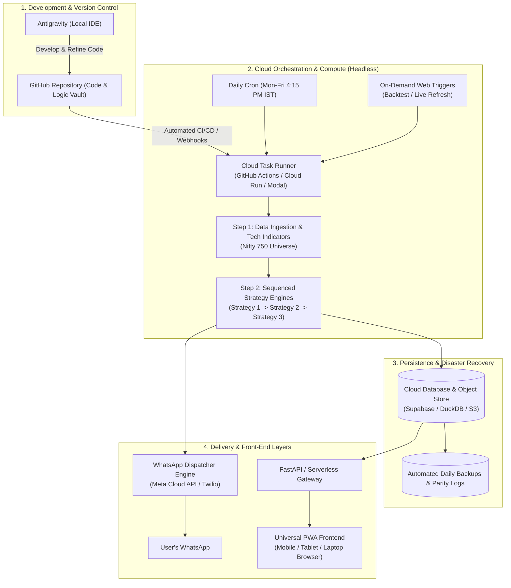
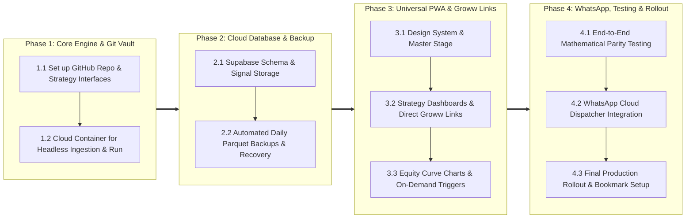

# Product Requirements Document (PRD)
## Project: Cloud-Native Multi-Strategy Trading Intelligence Platform
**Document Version:** 1.0.0  
**Status:** Draft for Review  
**Date:** September 2026  
**Author:** Antigravity AI & Architecture Team  

---

## 1. Executive Summary & Vision

The objective of this project is to transform a collection of local, offline Python trading strategies and historical data sync scripts into a **fully automated, cloud-native trading intelligence platform**. 

The platform will run autonomously in the cloud without requiring a laptop to be powered on. It will consolidate all daily technical indicators, market regime filters, and actionable breakout signals across multiple quantitative strategies into a single, cohesive, mobile- and desktop-friendly Progressive Web Application (PWA). It also dispatches timely daily alerts directly to **WhatsApp**.

The design guarantees that existing local projects and codebases remain uncorrupted, adopting a clean Git-backed architecture where **Antigravity** serves as the primary development workbench and **GitHub** serves as the versioned code vault and CI/CD orchestration engine.

---

## 2. Problem Statement & User Constraints

| Current State (Pain Points) | Target State (Platform Vision) |
| :--- | :--- |
| **Tied to Local Laptop**: Scheduled tasks fail if the laptop is shut down, sleeping, or disconnected from the internet. | **100% Cloud-Autonomous**: Daily data ingestion and strategy execution run on cloud compute automatically post-market close. |
| **Fragmented Outputs**: Each strategy generates separate standalone HTML/CSV files in different folders. | **Unified Stage & Dedicated Dashboards**: Single high-level aggregated signals board, accompanied by dedicated deep-dive dashboards for each individual strategy. |
| **Desktop-Only View**: Viewing reports on mobile requires remote desktop tools or manual file transfers. | **Universal Device Compatibility**: Responsive, app-like PWA accessible on any browser, smartphone (iOS/Android), tablet, or laptop. |
| **No Active Push Alerts**: Requires user to remember to open files. | **Automated WhatsApp Alerts**: Summary of market breadth, gate status, and fresh breakout triggers delivered directly to WhatsApp. |
| **No Authentication Friction**: User explicitly does not want login barriers, passwords, or biometrics. | **Zero-Friction Access**: Direct URL/PWA access with security handled via private deployment URL and backend API key isolation. |

---

## 3. High-Level System Architecture



---

## 4. Technology Stack Selection & Justification

| Layer | Recommended Technology | Justification & Expansion Capability |
| :--- | :--- | :--- |
| **Development** | **Antigravity IDE** | Rapid AI-assisted coding, mathematical verification, backtest auditing, and refactoring. |
| **Code Vault & CI/CD** | **GitHub** | Industry-standard version control, backup of all logic engines, and native workflow automation (GitHub Actions). |
| **Core Quant Engine** | **Python 3.11+ (Pandas, NumPy, TA-Lib/Numba)** | Maximum flexibility for quant development. Keeps 100% parity with existing formulas and vectorization rules. |
| **Cloud Compute (Headless)** | **GitHub Actions / Cloud Run / Modal** | Headless, serverless execution. Automatically wakes up at 4:15 PM IST, runs all tasks in ~3-5 minutes, and terminates. Near zero operating cost. |
| **Database & Persistence** | **Supabase (Managed PostgreSQL) + Cloudflare R2 / S3** | Relational integrity for trade logs, signals, and KPIs. Cheap object storage for historical parquet/CSV datasets. Full point-in-time recovery. |
| **Frontend Framework** | **Next.js (React) + Tailwind CSS + PWA (Progressive Web App)** | One unified codebase that renders natively on mobile (app icon, full screen, touch) and desktop (widescreen, dense data tables). |
| **Alert Delivery** | **WhatsApp Business Cloud API / Twilio WhatsApp API** | Native, highly reliable delivery to the user's personal WhatsApp number immediately after daily screener completion. |

---

## 5. Functional Specifications (Requirements)

### FR1: Headless Cloud Data Ingestion & Indicator Pipeline
- **Frequency**: Scheduled Monday through Friday at 4:15 PM IST (immediately after NSE official Bhavcopy settlement).
- **Holiday Awareness**: Must scrape or cross-reference the official NSE holiday calendar to skip non-trading days automatically.
- **Constituent Tracking**: Auto-fetch current constituent lists for NIFTY 500 and NIFTY Microcap 250 to dynamically accommodate quarterly rebalances.
- **Incremental Indicator Compute**: Ingest Day $T$ raw OHLCV and compute all 23 institutional indicators (Cutler RSI-14, SuperTrend [10, 3], Bollinger Bands [20, 2], MACD, ATR-14, SMAs/EMAs) with exact mathematical parity.

### FR2: Sequenced Multi-Strategy Execution Engine
- The platform must support sequential execution of multiple independent trading strategies.
- **Pluggable Architecture**: Every strategy must adhere to a standard abstract interface (`BaseStrategy`):
  - `load_data()`
  - `generate_signals()`
  - `run_backtest(params)`
  - `export_summary()`
- **Current Strategy Portfolio**:
  1. **Strategy A**: *3-Day RSI UP, Volume Surge, 52W High, Market Breadth* (Swing breakout + market breadth gate).
  2. **Strategy B**: *5-Year High Breakout Momentum (Clean Candle Quality Filter)*.
  3. **Strategy C**: *GFS Multi-Timeframe RSI (Daily / Weekly / Monthly)*.
- **Execution Output**: After each run, the engine outputs standardized JSON payloads containing:
  - Fresh Buy/Sell signals for Day $T+1$ execution.
  - Active trade tracking (Entry price, current price, stop loss, trailing exit, days held).
  - High-level KPIs (Win rate, Sharpe, CAGR, Max Drawdown).

### FR3: Universal Cross-Device Frontend (PWA)
- **Single Stage View (Consolidated Master Stage)**:
  - High-level snapshot of market regime (e.g., Nifty 500 Market Breadth % and Gate Status: OPEN/CLOSED).
  - Aggregated list of all fresh breakout signals triggered today across all active strategies.
  - Quick comparison card of active open positions across strategies.
- **Dedicated Strategy Dashboards**:
  - A tab or dedicated screen for each individual strategy.
  - Detailed parameter inspection (RSI floors, ATR multiples, volume hurdles).
  - Historical backtest equity curve and monthly breakdown matrix.
  - Complete trade log with search, sort, and export to CSV capabilities.
- **Device Adaptability**:
  - **Mobile**: Single-column card layout, swipeable views, sticky bottom navigation, touch-friendly rows.
  - **Laptop/Browser**: Multi-column widescreen view, collapsible sidebars, dense data tables with full horizontal scroll.
- **Direct Groww Chart Hyperlink Integration**:
  - Every stock record (in Fresh Triggers, Active Positions, and Trade Logs) features a direct 1-tap/click hyperlink navigating directly to its official Groww chart in a new tab:
    `https://groww.in/charts/stocks/<groww-slug>?exchange=NSE`
    *(e.g., `graphite-india-ltd`, `reliance-industries-ltd`, `cupid-ltd`)*.
  - **No In-App Candlestick Charting**: Stock technical charts are intentionally not rendered inside this tool, avoiding bundle bloat and delegating technical charting directly to the Groww broker portal.
- **Access Protocol**: Zero login friction—no username, password, PIN, or biometric requirements. Direct access via secure URL.

### FR4: On-Demand Interactive Refresh Engine
- The PWA must provide simple 1-tap interactive action buttons:
  - **"Refresh Daily Signals"**: Manually triggers the cloud screener for on-demand mid-day or post-market scans across the strategies.
  - **"Refresh Backtest"**: Executes an on-demand full refresh of the historical backtest for a selected strategy using its existing, codified backtesting engine—re-simulating all historical trades up to the latest available data date and refreshing the equity curve, KPI metrics, and audited trade log.

### FR5: Automated WhatsApp Alert Dispatcher
- Dispatched automatically upon conclusion of the daily cloud run.
- **Message Structure**:
  ```text
  ⚡ QUANT TRADING INTELLIGENCE REPORT [11-Sep-2026]
  
  📊 Market Regime:
  • Nifty 500 Breadth: 54.2% (BULLISH - GATE OPEN)
  
  🎯 Fresh Triggers (2 Candidates):
  1. TATAMOTORS [Strategy: 3-Day RSI Breakout]
     • Entry Trigger: ₹1,045.50
     • Initial SL: ₹1,012.00 (-3.2%)
     • Vol Surge: 3.4x | RSI: 64.2
  2. BEL [Strategy: 5Y Clean Candle Breakout]
     • Entry: Market Open (₹315.00)
     • Target: ₹340.20 (+8.0%) | SL: ₹304.50
  
  🛡️ Active Positions: 3 Open (Unrealized: +4.8%)
  🔗 View Full Dashboard: https://your-trading-pwa.app
  ```

---

## 6. UI/UX Design System & Experience Architecture (ui-ux-pro-max)

### 6.1 Design Direction & Aesthetic Philosophy
The interface is designed as an **Institutional Quantitative Command Center**, blending the visual clarity and high information density of high-frequency trading terminals (Bloomberg/Refinitiv) with the fluid micro-interactions and tactile responsiveness of modern mobile-first applications.

```
┌────────────────────────────────────────────────────────────────────────┐
│ UI/UX DESIGN SYSTEM TOKEN MANIFEST                                     │
├───────────────────┬────────────────────────────────────────────────────┤
│ Aesthetic Style   │ Dark Mode (OLED Midnight), Glassmorphic Surface    │
│ Primary Neutral   │ #020617 (Slate 950 - Canvas Base)                  │
│ Surface / Card    │ #0F172A (Slate 900 / 80% with backdrop-blur-md)    │
│ Card Border       │ #1E293B (Slate 800 - 1px hairline border)          │
│ Bullish / Gains   │ #22C55E (Emerald 500) | Glow: rgba(34,197,94,0.15) │
│ Bearish / Losses  │ #EF4444 (Rose 500)    | Glow: rgba(239,68,68,0.15) │
│ Accent / Triggers │ #38BDF8 (Sky 400 - Actionable Breakouts & Indices) │
│ Primary Font      │ Inter (UI labels, navigation, titles)              │
│ Financial Font    │ Fira Code / JetBrains Mono (tabular-nums figures)  │
└───────────────────┴────────────────────────────────────────────────────┘
```

#### Key Visual Guidelines:
- **Tabular Monospace Alignment**: All numbers, stock prices, percentages, dates, and indicator values utilize monospace tabular figures (`font-variant-numeric: tabular-nums; font-family: 'Fira Code', monospace;`). This completely eliminates jitter during live refreshes and aligns decimal places perfectly in data tables.
- **Micro-Glow & State Indicators**:
  - Live system status: Pulsing emerald beacon (`animate-pulse`).
  - Defensive regime: Deep amber/rose border illumination with clear visual gating (`GATE: CLOSED`).
- **Touch-Friendly Tap Targets**: Mobile interactive elements strictly adhere to $\ge 44 \times 44\text{ px}$ clickable hit-boxes.

---

### 6.2 Universal Cross-Device Layout Architecture

#### A. Mobile Viewport (iPhone / Android Smartphones, 375px – 768px)
Designed for effortless one-handed thumb navigation while on the move:

```
┌────────────────────────────────────────────────────────────────────────┐
│ [●] LIVE SYSTEM  •  NIFTY 750              [⚡ Refresh]  [11-Sep-2026] │
├────────────────────────────────────────────────────────────────────────┤
│ ┌────────────────────────────────────────────────────────────────────┐ │
│ │ SWIPEABLE KPI CAROUSEL (Touch Drag / Snap)                         │ │
│ │ ┌──────────────────┐ ┌──────────────────┐ ┌──────────────────┐     │ │
│ │ │ MARKET BREADTH   │ │ TODAY'S TRIGGERS │ │ ACTIVE SLOTS     │ ... │ │
│ │ │ 39.0% (DEFENSIVE)│ │ 1 Breakout Stock │ │ 2 / 5 Filled     │     │ │
│ │ └──────────────────┘ └──────────────────┘ └──────────────────┘     │ │
│ └────────────────────────────────────────────────────────────────────┘ │
│                                                                        │
│ ┌────────────────────────────────────────────────────────────────────┐ │
│ │ ⚠️ REGIME BANNER: ENTRY GATE CLOSED (Breadth < 50.0%)               │ │
│ └────────────────────────────────────────────────────────────────────┘ │
│                                                                        │
│ ┌────────────────────────────────────────────────────────────────────┐ │
│ │ SIGNAL CARD: TATAMOTORS                                [3-Day RSI] │ │
│ │ Close: ₹1,045.50  •  Trigger: ₹1,046.00  •  Trailing SL: ₹1,012.00 │ │
│ │ Vol Surge: 3.4x [SMA10]  •  RSI: 64.2 (+3-Day Rising)              │ │
│ │ [ ↗ Open Groww Chart (NSE) ]                                       │ │
│ └────────────────────────────────────────────────────────────────────┘ │
│                                                                        │
│ ┌────────────────────────────────────────────────────────────────────┐ │
│ │ STICKY BOTTOM NAVIGATION DOCK (1-Thumb Reach)                      │ │
│ │   [🏛️ Stage]    [📈 3D-RSI]    [🚀 5Y-High]    [⏱️ GFS]    [📋 Logs]│ │
│ └────────────────────────────────────────────────────────────────────┘ │
└────────────────────────────────────────────────────────────────────────┘
```

#### B. Laptop / Widescreen Desktop Viewport (1024px – 2560px)
Designed for institutional-grade market overview and high data density:

```
┌───────────────────────────────────────────────────────────────────────────────────────────┐
│ QUANTFLOW INTELLIGENCE PORTAL   |   NIFTY 750 UNIVERSE   |   LAST SYNC: 11-SEP 16:15 IST     │
├──────────────┬───────────────────────────────────────────┬────────────────────────────────┤
│ NAVIGATION   │ MASTER STAGE: CONSOLIDATED SIGNALS        │ PORTFOLIO & REGIME OVERVIEW    │
│              │                                           │                                │
│ • All-in-One │ ┌───────────────────────────────────────┐ │ ┌────────────────────────────┐ │
│   Stage      │ │ Search Symbol / Filter Strategy...    │ │ │ MARKET BREADTH RADIAL GAUGE│ │
│ • 3-Day RSI  │ ├───────────────────────────────────────┤ │ │      ╭───────╮             │ │
│ • 5Y-Breakout│ │ SYMBOL  STRATEGY   TRIGGER   SL  GROWW│ │ │     (  39.0%  )  DEFENSIVE │ │
│ • GFS MTF    │ │ TATAMO.. 3D-RSI    1046.00  1012 [↗]  │ │ │      ╰───────╯   (GATE OFF)│ │
│ • Data Logs  │ │ BEL      5Y-High    315.00   304 [↗]  │ │ └────────────────────────────┘ │
│              │ │ HAL      GFS-MTF   4820.00  4680 [↗]  │ │ ┌────────────────────────────┐ │
│              │ └───────────────────────────────────────┘ │ │ ACTIVE POSITIONS TRACKER  │ │
│ [⚡ REFRESH]  │ ┌───────────────────────────────────────┐ │ │ Slot 1: VBL (+14.2% / Day 8) │ │
│ Signals/Back.│ │ STRATEGY KPI & EQUITY CURVE SUMMARY   │ │ │ Slot 2: TRENT (+6.8% / D 12)│ │
│              │ │ (Portfolio CAGR 28.5%, MDD -21.26%)   │ │ │ Slot 3..5: [AVAILABLE CASH]│ │
│              │ └───────────────────────────────────────┘ │ └────────────────────────────┘ │
└──────────────┴───────────────────────────────────────────┴────────────────────────────────┘
```

---

### 6.3 Visual Analytics & Direct Groww Chart Integration

#### A. Direct Broker Integration (Groww Chart Hyperlinks)
- Stock technical charting is **intentionally delegated directly to Groww**, eliminating heavy charting client-side bundles and enabling the user to analyze candles on their actual trading broker portal.
- **Direct 1-Tap Link**: Every stock symbol across the application (Fresh Signals, Active Open Positions, and Historical Trade Logs) provides a direct hyperlink that opens its Groww interactive chart in a new browser tab:
  ```text
  URL Pattern: https://groww.in/charts/stocks/<groww-slug>?exchange=NSE
  
  Canonical Verified Examples:
  • Graphite India Ltd.       -> https://groww.in/charts/stocks/graphite-india-ltd?exchange=NSE
  • Reliance Industries Ltd.  -> https://groww.in/charts/stocks/reliance-industries-ltd?exchange=NSE
  • Cupid Ltd.                -> https://groww.in/charts/stocks/cupid-ltd?exchange=NSE
  ```
- **Automated Slug Generation Engine**:
  - The backend data ingestion pipeline normalizes official constituent company names into verified Groww URL slugs upon daily constituent synchronization:
    $$\text{Company Name} \xrightarrow{\text{lowercase, replace non-alphanumeric with hyphen}} \text{Groww Slug}$$
  - The resulting `groww_chart_url` is stored alongside each stock's metadata in the database, guaranteeing instant, error-free navigation with zero client-side latency.

#### B. In-App Visual Analytics Scope
In-app charting is focused strictly on **macro market conditions and strategy portfolio performance**:
1. **Synchronized Portfolio Equity Curve & Underwater Drawdown Chart**:
   - Displays 5-year compounding portfolio growth vs. the NIFTY 500 benchmark.
   - Lower pane highlights the drawdown percentage curve with shaded rose alert zones for the $-21.26\%$ historical MDD boundary.
2. **Market Breadth Semicircular Radial Gauge**:
   - Real-time gauge illustrating the percentage of NIFTY 500 stocks trading above their 50-day EMA.
   - Clearly segmented into **Defensive Zone ($< 50\%$)** and **Aggressive Zone ($\ge 50\%$)** with real-time gate state indications (`GATE: OPEN` vs. `GATE: CLOSED`).
3. **Monthly Returns Calendar Heatmap**:
   - Institutional 12-month calendar grid displaying historical returns by month and year on a color-coded green-to-red scale.

---

### 6.4 Large Dataset Virtualization & Performance (Zero-Lag UX)

Because the system manages 750 constituent stocks and multi-year trade logs (hundreds of historical executions):

1. **Virtual DOM Table Virtualization (`@tanstack/react-virtual`)**:
   - The table renders **only the visible rows** (~15–20 rows at any given scroll position), keeping memory footprint under 20 MB.
   - Enables silky-smooth infinite scrolling across 750 stocks and 500+ trade history items.
2. **Instant Client-Side Multi-Facet Search & Filter**:
   - Search by symbol, company name, industry, or strategy tag with immediate ($<5\text{ms}$) debounced filtering.
   - Quick filter buttons: `[All]`, `[NIFTY 500]`, `[MICROCAP 250]`, `[Volume > 3x]`, `[RSI > 60]`.
3. **Ultra-Lightweight API Payloads**:
   - Since stock candlestick series are offloaded to Groww, the entire daily signals payload is extremely compact ($\approx 15\text{ KB}$ JSON), guaranteeing instant sub-second loading on mobile networks.

---

### 6.5 Screen-by-Screen UX Specifications

#### Screen 1: Master Stage ("All-in-One Signal Nexus")
- **Purpose**: Single consolidated command deck giving an immediate answer to: *"What is the market doing today, and what stocks should I buy tomorrow morning?"*
- **Components**:
  - **Market Breadth Gauge & Gate Banner**: Visual gauge showing % of stocks $> \text{EMA}_{50}$. Highlights `GATE: OPEN` (Green) or `GATE: CLOSED (Cash Protection Active)` (Red).
  - **Unified Fresh Triggers List**: Aggregated table/cards of all stocks triggering buy criteria today across Strategy 1, Strategy 2, and Strategy 3, tagged with distinct strategy badges.
  - **Active Trade Tracker**: Real-time status of current open portfolio positions, showing current price, unrealized P&L %, days held, and distance to trailing stop loss.
  - **1-Tap Action Bar**: "Refresh Daily Signals" with spinning loader and timestamp of last execution.

#### Screen 2: Dedicated Strategy Dashboards (1 Tab Per Strategy)
- **Tabs**:
  - `Strategy 1: 3-Day RSI + 52W High Breakout`
  - `Strategy 2: 5Y Clean Candle Breakout`
  - `Strategy 3: GFS Multi-Timeframe RSI`
- **Components per Dashboard**:
  - **Strategy KPI Scorecard**: 8 key institutional metrics displayed in a high-density grid:
    - Initial Capital (₹10.00L) | Final Equity | Net CAGR (%) | Max Drawdown (%)
    - Win Rate (%) | Profit Factor | Realized Risk-to-Reward | Trade Expectancy (₹)
  - **Interactive Equity Curve**: Zoomable chart spanning the full backtest horizon with toggleable Benchmark comparison.
  - **Audited Trade Log**: Complete historical trade list with sorting by Entry Date, Exit Date, Return %, and Holding Days.
  - **"Refresh Backtest" Action Button**: 1-click cloud re-simulation using the codified strategy engine to extend the backtest up to today's date.

#### Screen 3: Historical Dataset & Cloud System Health
- **Purpose**: System transparency and auditability.
- **Components**:
  - Master dataset synchronization status (Last Bhavcopy sync time, total active constituents: 500 + 250 = 750).
  - NSE Holiday calendar preview.
  - Cloud database backup status and disaster recovery download link (Export master CSV/Parquet).

---

## 7. Non-Functional Requirements (NFRs)

1. **Performance**:
   - PWA initial page load time $< 1.5$ seconds on 4G mobile networks.
   - Smooth 60 FPS scrolling on mobile and desktop via DOM virtualization.
   - Cloud daily execution time $< 4$ minutes for all 750 stocks and all strategies.
2. **Availability & Resilience**:
   - 99.9% uptime for cloud data store and frontend hosting (leveraging global CDNs).
   - Automatic retry logic (up to 3 attempts with exponential backoff) for data feeds.
3. **Extensibility**:
   - Standardized `BaseStrategy` interface allows plugging in a brand new trading strategy in under 30 minutes.
4. **Data Durability**:
   - Daily automated backups to cloud storage with point-in-time recovery.

---

## 8. Phased Implementation Roadmap



---

## 9. Success Metrics
- **Zero Laptop Dependency**: Daily screener and data updates run 100% reliably for 30 consecutive trading sessions without opening the laptop.
- **Instant Awareness**: Verified WhatsApp alert received within 15 minutes of market close (by 4:30 PM IST).
- **Seamless Mobility**: Ability to check all active strategy signals on a mobile device in under 10 seconds.
- **Silky Table & Deep Link Performance**: Instant search and zero frame drops while navigating 750 stocks and opening direct Groww chart links.
